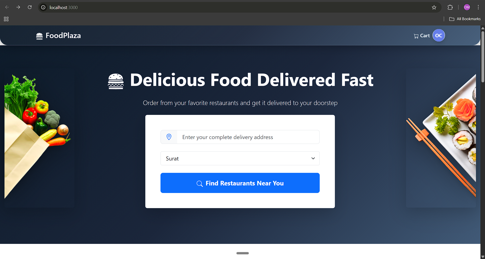
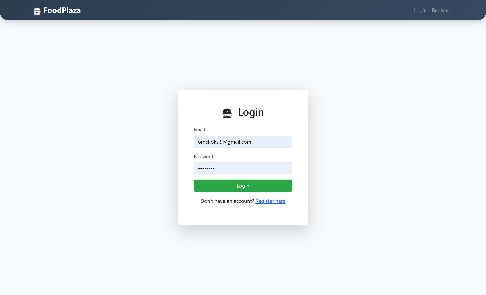
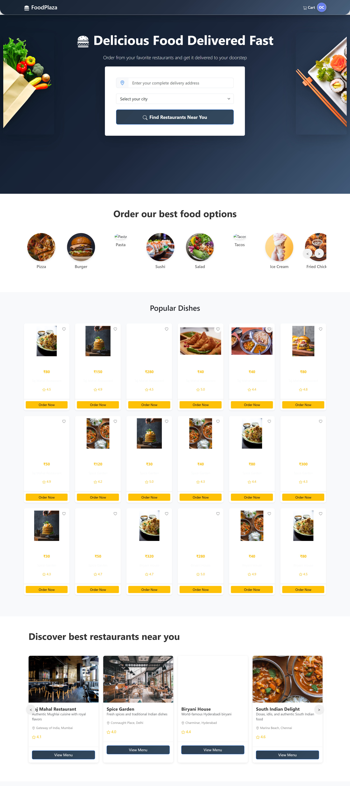
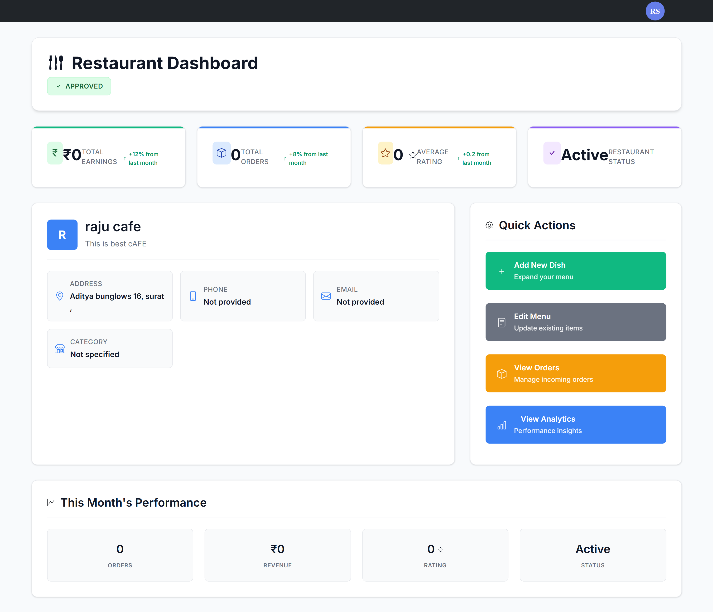
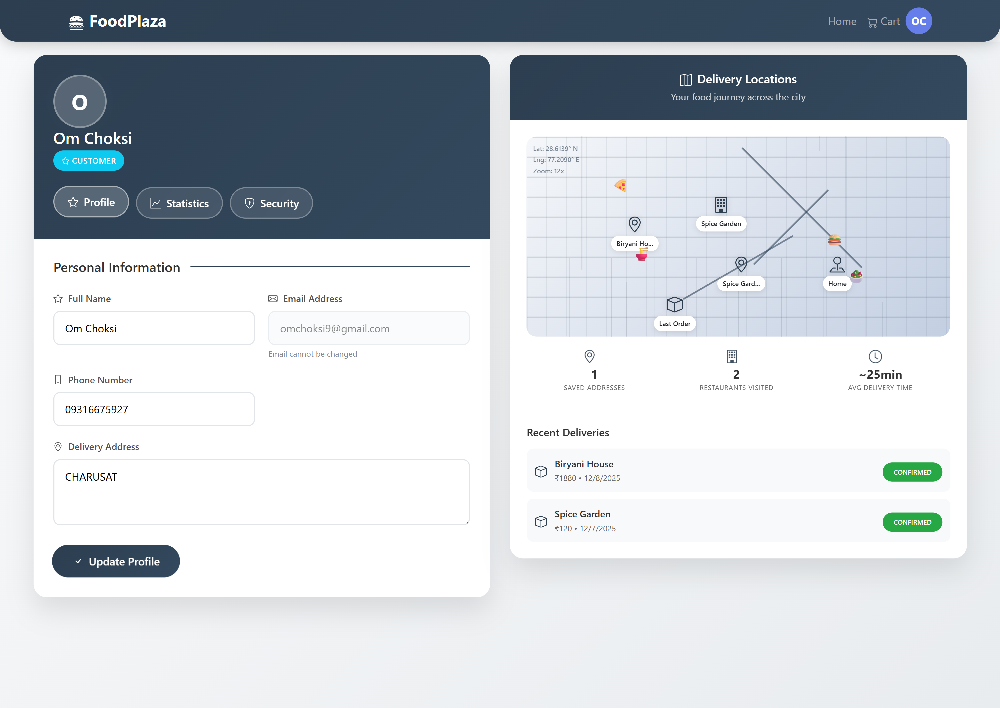
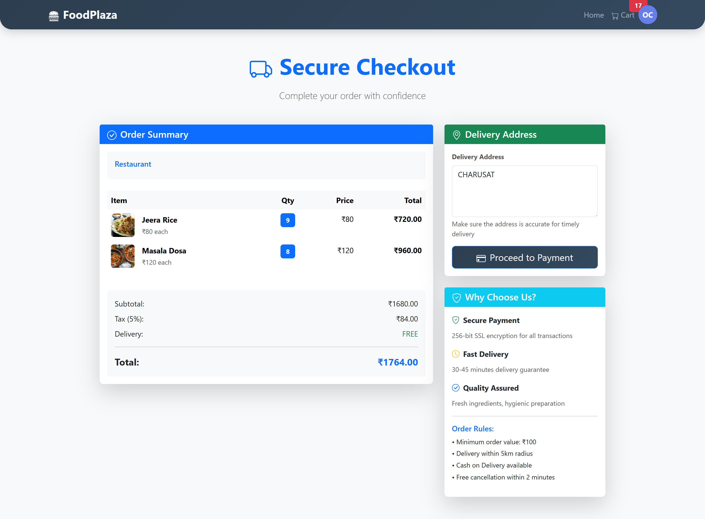
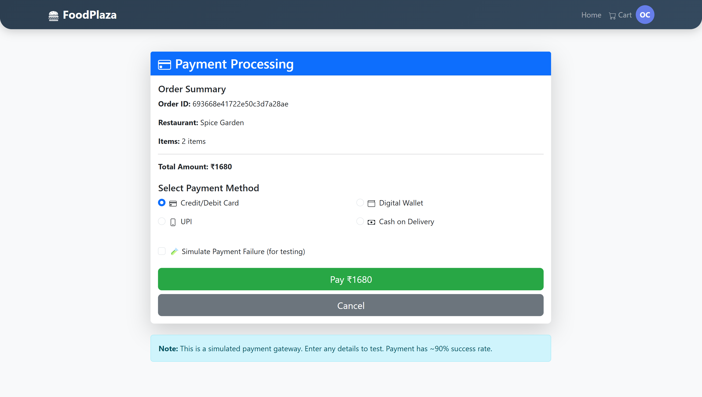

# Online Food Ordering System

A comprehensive web-based food ordering platform built for the Indian market, supporting multiple user roles with complete order management, payment processing, and administrative controls.

## Table of Contents

- [Overview](#overview)
- [Features](#features)
- [Technology Stack](#technology-stack)
- [Database Schema](#database-schema)
- [Project Structure](#project-structure)
- [Installation & Setup](#installation--setup)
- [API Endpoints](#api-endpoints)
- [Usage](#usage)
- [Screenshots](#screenshots)
- [Contributing](#contributing)
- [License](#license)

## Overview

This Online Food Ordering System is designed to connect customers with local restaurants while providing restaurant owners with powerful management tools and administrators with comprehensive oversight capabilities. The platform supports secure user authentication, real-time order tracking, payment processing simulation, and comprehensive reporting features.

### Key Highlights

- **Multi-role Architecture**: Supports Customer, Restaurant Owner, Admin, and Super Admin roles
- **Indian Market Focus**: All pricing and transactions in Indian Rupees (INR)
- **Real-time Updates**: Live order status tracking and notifications
- **Payment Simulation**: Realistic payment processing with success/failure scenarios
- **Comprehensive Analytics**: Detailed reporting and performance metrics
- **Mobile-Responsive**: Optimized for all device types

### Use Cases

1. **For Customers**:
   - Discover and order from nearby restaurants
   - Track orders in real-time
   - Manage payment methods and order history
   - Rate and review restaurants and food items

2. **For Restaurant Owners**:
   - Manage menu items and pricing
   - Process and fulfill orders
   - Track earnings and performance metrics
   - Respond to customer feedback

3. **For Administrators**:
   - Oversee platform operations
   - Manage user accounts and restaurant approvals
   - Generate comprehensive reports
   - Monitor system performance and revenue

## Features

### Customer Features

- **User Registration & Authentication**: Secure signup and login with JWT tokens
- **Restaurant Discovery**: Browse restaurants by location, cuisine, and ratings
- **Advanced Search & Filtering**: Search by food items, price range, and categories
- **Shopping Cart**: Add/remove items with quantity management
- **Order Placement**: Complete checkout process with delivery address
- **Payment Processing**: Simulated payment gateway with multiple methods
- **Order Tracking**: Real-time status updates from pending to delivered
- **Order History**: Complete order history with receipts
- **Order Cancellation**: Cancel orders within specified timeframes with refund
- **Rating & Reviews**: Rate restaurants and individual food items
- **Profile Management**: Update personal information and preferences

### Restaurant Owner Features

- **Restaurant Registration**: Apply for restaurant approval with documentation
- **Menu Management**: Add, edit, delete food items with detailed information
- **Order Management**: Accept/reject orders and update preparation status
- **Earnings Tracking**: Monitor daily, weekly, and monthly revenue
- **Customer Feedback**: View ratings and reviews from customers
- **Performance Analytics**: Track popular items and customer preferences
- **Availability Management**: Mark items as available/unavailable
- **Order Notifications**: Real-time alerts for new orders

### Administrator Features

- **User Management**: View, edit, and manage all user accounts
- **Restaurant Approval**: Review and approve/reject restaurant applications
- **Platform Oversight**: Monitor all orders, payments, and transactions
- **Revenue Analytics**: Generate reports on total revenue and performance
- **System Monitoring**: Track platform health and user activity
- **Content Management**: Manage categories and system-wide settings
- **Dispute Resolution**: Handle customer complaints and restaurant issues
- **Performance Reports**: Generate detailed analytics and insights

## Technology Stack

### Frontend
- **React.js 19.2.0**: Modern JavaScript library for building user interfaces
- **React Router DOM 7.9.5**: Declarative routing for React applications
- **Bootstrap 5.3.8**: CSS framework for responsive design
- **React Icons 5.5.0**: Icon library for consistent UI elements
- **Axios 1.13.1**: HTTP client for API communications
- **React Toastify 11.0.5**: Notification system for user feedback

### Backend
- **Node.js**: JavaScript runtime environment
- **Express.js 4.19.2**: Web application framework for Node.js
- **MongoDB 8.3.2**: NoSQL database for data storage
- **Mongoose**: ODM for MongoDB and Node.js
- **JWT 9.0.2**: JSON Web Tokens for authentication
- **bcryptjs 2.4.3**: Password hashing library
- **CORS 2.8.5**: Cross-origin resource sharing middleware

### Development Tools
- **Nodemon**: Automatic server restart during development
- **Create React App**: Build setup for React applications
- **ESLint**: Code linting and formatting
- **Testing Library**: Testing utilities for React components

## Database Schema

### Users Collection

| Field | Type | Required | Description |
|-------|------|----------|-------------|
| _id | ObjectId | Auto | Unique identifier |
| name | String | Yes | User's full name |
| email | String | Yes | Unique email address |
| password | String | Yes | Hashed password |
| role | String | Yes | User role: customer/restaurant/admin/superadmin |
| phone | String | No | Contact phone number |
| address | String | No | Delivery/residential address |
| profilePicture | String | No | URL to profile image |
| isActive | Boolean | No | Account status (default: true) |
| restaurantId | ObjectId | No | Reference to restaurant (for owners) |
| totalEarnings | Number | No | Total earnings (for restaurant owners) |
| totalOrders | Number | No | Total orders placed (for customers) |
| totalSpent | Number | No | Total amount spent (for customers) |
| createdAt | Date | Auto | Account creation timestamp |
| updatedAt | Date | Auto | Last update timestamp |

### Restaurants Collection

| Field | Type | Required | Description |
|-------|------|----------|-------------|
| _id | ObjectId | Auto | Unique identifier |
| name | String | Yes | Restaurant name |
| description | String | No | Restaurant description |
| address | String | Yes | Restaurant address |
| image | String | No | Restaurant image URL |
| owner | ObjectId | Yes | Reference to restaurant owner (User) |
| approvalStatus | String | No | Status: pending/approved/rejected |
| isActive | Boolean | No | Restaurant active status |
| rating | Number | No | Average customer rating |
| totalOrders | Number | No | Total orders fulfilled |
| totalEarnings | Number | No | Total revenue generated |
| rejectionReason | String | No | Reason for rejection (if applicable) |
| createdAt | Date | Auto | Restaurant creation timestamp |
| updatedAt | Date | Auto | Last update timestamp |

### Food Items Collection

| Field | Type | Required | Description |
|-------|------|----------|-------------|
| _id | ObjectId | Auto | Unique identifier |
| name | String | Yes | Food item name |
| description | String | No | Item description |
| price | Number | Yes | Price in INR |
| image | String | No | Food item image URL |
| restaurant | ObjectId | Yes | Reference to restaurant |
| category | String | Yes | Food category (e.g., Main Course, Dessert) |
| isAvailable | Boolean | No | Item availability status |
| rating | Number | No | Average customer rating |
| totalRatings | Number | No | Number of ratings received |
| preparationTime | Number | No | Preparation time in minutes |
| calories | Number | No | Calorie count |
| isVegetarian | Boolean | No | Vegetarian classification |
| isVegan | Boolean | No | Vegan classification |
| spiceLevel | String | No | Spice level: None/Low/Medium/Medium-High/High |
| allergens | Array | No | List of allergens |
| createdAt | Date | Auto | Item creation timestamp |
| updatedAt | Date | Auto | Last update timestamp |

### Orders Collection

| Field | Type | Required | Description |
|-------|------|----------|-------------|
| _id | ObjectId | Auto | Unique identifier |
| user | ObjectId | Yes | Reference to customer (User) |
| restaurant | ObjectId | Yes | Reference to restaurant |
| items | Array | Yes | Array of ordered items with quantity and price |
| totalAmount | Number | Yes | Total order amount in INR |
| deliveryAddress | String | Yes | Delivery address |
| status | String | No | Order status: pending/accepted/rejected/preparing/ready/out_for_delivery/delivered/cancelled |
| paymentStatus | String | No | Payment status: pending/completed/failed/refunded/cod |
| paymentMethod | String | No | Payment method: card/upi/wallet |
| paymentId | String | No | Payment transaction ID |
| refundAmount | Number | No | Refund amount in INR |
| refundStatus | String | No | Refund status: none/initiated/completed |
| rejectionReason | String | No | Reason for order rejection |
| customerFeedback | String | No | Customer feedback/comments |
| rating | Number | No | Customer rating (1-5) |
| createdAt | Date | Auto | Order creation timestamp |
| deliveredAt | Date | No | Delivery completion timestamp |
| updatedAt | Date | Auto | Last update timestamp |

### Payments Collection

| Field | Type | Required | Description |
|-------|------|----------|-------------|
| _id | ObjectId | Auto | Unique identifier |
| order | ObjectId | Yes | Reference to order |
| user | ObjectId | Yes | Reference to customer (User) |
| amount | Number | Yes | Payment amount in INR |
| paymentMethod | String | Yes | Payment method: card/upi/wallet |
| paymentGateway | String | No | Payment gateway used |
| transactionId | String | Yes | Unique transaction identifier |
| status | String | No | Payment status: success/failed/pending |
| failureReason | String | No | Reason for payment failure |
| timestamp | Date | Auto | Payment timestamp |
| createdAt | Date | Auto | Record creation timestamp |
| updatedAt | Date | Auto | Last update timestamp |

### Reviews Collection

| Field | Type | Required | Description |
|-------|------|----------|-------------|
| _id | ObjectId | Auto | Unique identifier |
| order | ObjectId | Yes | Reference to order |
| customer | ObjectId | Yes | Reference to customer (User) |
| restaurant | ObjectId | Yes | Reference to restaurant |
| foodItem | ObjectId | No | Reference to specific food item |
| rating | Number | Yes | Rating value (1-5) |
| comment | String | No | Review comment (max 500 characters) |
| type | String | Yes | Review type: food/restaurant |
| createdAt | Date | Auto | Review creation timestamp |
| updatedAt | Date | Auto | Last update timestamp |

## Project Structure

```
online-food-order/
│
├── backend/
│   ├── config/
│   │   └── db.js                 # Database configuration
│   ├── middleware/
│   │   └── auth.js              # Authentication middleware
│   ├── models/
│   │   ├── User.js              # User schema
│   │   ├── Restaurant.js        # Restaurant schema
│   │   ├── FoodItem.js          # Food item schema
│   │   ├── Order.js             # Order schema
│   │   ├── Payment.js           # Payment schema
│   │   └── Review.js            # Review schema
│   ├── routes/
│   │   ├── authRoutes.js        # Authentication routes
│   │   ├── orderRoutes.js       # Order management routes
│   │   ├── restaurantRoutes.js  # Restaurant routes
│   │   └── adminRoutes.js       # Admin routes
│   ├── seed.js                  # Database seeding script
│   ├── server.js                # Main server file
│   └── package.json             # Backend dependencies
│
├── frontend/
│   ├── public/
│   │   ├── index.html           # Main HTML file
│   │   ├── manifest.json        # PWA manifest
│   │   └── assets/              # Static assets
│   ├── src/
│   │   ├── components/          # Reusable UI components
│   │   │   ├── Header.js        # Navigation header
│   │   │   ├── Cart.js          # Shopping cart component
│   │   │   ├── LoadingSpinner.js # Loading indicator
│   │   │   └── Toast.js         # Notification component
│   │   ├── pages/               # Page components
│   │   │   ├── Home.js          # Homepage
│   │   │   ├── Login.js         # Login page
│   │   │   ├── Register.js      # Registration page
│   │   │   ├── Cart.js          # Shopping cart page
│   │   │   ├── Checkout.js      # Checkout process
│   │   │   ├── OrderDetails.js  # Order details page
│   │   │   ├── Profile.js       # User profile page
│   │   │   ├── admin/           # Admin pages
│   │   │   │   ├── Dashboard.js # Admin dashboard
│   │   │   │   ├── Users.js     # User management
│   │   │   │   └── Reports.js   # Reports and analytics
│   │   │   └── restaurant/      # Restaurant owner pages
│   │   │       ├── Dashboard.js # Restaurant dashboard
│   │   │       ├── Menu.js      # Menu management
│   │   │       └── Orders.js    # Order management
│   │   ├── context/             # React context providers
│   │   │   ├── AuthContext.js   # Authentication context
│   │   │   └── CartContext.js   # Shopping cart context
│   │   ├── hooks/               # Custom React hooks
│   │   │   ├── useAuth.js       # Authentication hook
│   │   │   └── useCart.js       # Cart management hook
│   │   ├── services/            # API service functions
│   │   │   ├── authService.js   # Authentication API calls
│   │   │   ├── orderService.js  # Order API calls
│   │   │   └── restaurantService.js # Restaurant API calls
│   │   ├── App.js               # Main application component
│   │   ├── App.css              # Global styles
│   │   ├── index.js             # Application entry point
│   │   └── index.css            # Base styles
│   └── package.json             # Frontend dependencies
│
├── assets/                      # Screenshots and documentation images
├── docs/                        # Documentation files
├── README.md                    # Project documentation
└── .gitignore                   # Git ignore rules
```

## Installation & Setup

### Prerequisites

- Node.js (v16 or higher)
- MongoDB (v5 or higher)
- npm or yarn package manager

### Backend Setup

1. **Clone the repository**
   ```bash
   git clone https://github.com/omchoksi108/online-food-order.git
   cd online-food-order/backend
   ```

2. **Install dependencies**
   ```bash
   npm install
   ```

3. **Environment Configuration**
   Create a `.env` file in the backend directory:
   ```env
   PORT=5000
   MONGODB_URI=mongodb://localhost:27017/food-ordering
   JWT_SECRET=your_jwt_secret_key_here
   NODE_ENV=development
   ```

4. **Start MongoDB**
   Make sure MongoDB is running on your system.

5. **Seed the database** (optional)
   ```bash
   npm run seed
   ```

6. **Start the backend server**
   ```bash
   npm run dev
   ```

The backend server will start on `http://localhost:5000`

### Frontend Setup

1. **Navigate to frontend directory**
   ```bash
   cd ../frontend
   ```

2. **Install dependencies**
   ```bash
   npm install
   ```

3. **Start the development server**
   ```bash
   npm start
   ```

The frontend application will open at `http://localhost:3000`

### Production Build

1. **Build the frontend**
   ```bash
   cd frontend
   npm run build
   ```

2. **Start the backend in production**
   ```bash
   cd ../backend
   npm start
   ```

## API Endpoints

### Authentication Routes

| Method | Endpoint | Description | Access |
|--------|----------|-------------|---------|
| POST | `/api/auth/register` | User registration | Public |
| POST | `/api/auth/login` | User login | Public |
| GET | `/api/auth/profile` | Get user profile | Authenticated |
| PUT | `/api/auth/profile` | Update user profile | Authenticated |

### Restaurant Routes

| Method | Endpoint | Description | Access |
|--------|----------|-------------|---------|
| POST | `/api/restaurants` | Register new restaurant | Restaurant Owner |
| GET | `/api/restaurants` | Get all approved restaurants | Public |
| GET | `/api/restaurants/my` | Get owner's restaurant | Restaurant Owner |
| PUT | `/api/restaurants/:id` | Update restaurant | Restaurant Owner |
| GET | `/api/restaurants/:id/menu` | Get restaurant menu | Public |
| POST | `/api/restaurants/:id/menu` | Add menu item | Restaurant Owner |
| PUT | `/api/restaurants/menu/:itemId` | Update menu item | Restaurant Owner |
| DELETE | `/api/restaurants/menu/:itemId` | Delete menu item | Restaurant Owner |

### Order Routes

| Method | Endpoint | Description | Access |
|--------|----------|-------------|---------|
| POST | `/api/orders` | Place new order | Customer |
| GET | `/api/orders` | Get user's orders | Customer |
| GET | `/api/orders/restaurant` | Get restaurant's orders | Restaurant Owner |
| GET | `/api/orders/:id` | Get order details | Customer/Restaurant |
| PUT | `/api/orders/:id/status` | Update order status | Restaurant Owner |
| PUT | `/api/orders/:id/cancel` | Cancel order | Customer |
| POST | `/api/orders/:id/review` | Add review | Customer |

### Admin Routes

| Method | Endpoint | Description | Access |
|--------|----------|-------------|---------|
| GET | `/api/admin/users` | Get all users | Admin |
| GET | `/api/admin/restaurants` | Get all restaurants | Admin |
| PUT | `/api/admin/restaurants/:id/approve` | Approve restaurant | Admin |
| PUT | `/api/admin/restaurants/:id/reject` | Reject restaurant | Admin |
| GET | `/api/admin/orders` | Get all orders | Admin |
| GET | `/api/admin/stats` | Get platform statistics | Admin |
| GET | `/api/admin/reports` | Generate reports | Admin |

## Usage

### For Customers

1. **Register/Login**: Create an account or log in with existing credentials
2. **Browse Restaurants**: Explore available restaurants and their menus
3. **Add to Cart**: Select items and add them to your shopping cart
4. **Checkout**: Provide delivery address and select payment method
5. **Track Orders**: Monitor order status in real-time
6. **Rate & Review**: Provide feedback after order delivery

### For Restaurant Owners

1. **Register Restaurant**: Apply for restaurant approval with required details
2. **Manage Menu**: Add, edit, and organize food items
3. **Process Orders**: Accept orders and update preparation status
4. **Monitor Performance**: Track earnings and customer feedback
5. **Update Availability**: Mark items as available/unavailable

### For Administrators

1. **User Management**: Oversee all user accounts and permissions
2. **Restaurant Approvals**: Review and approve restaurant applications
3. **System Monitoring**: Track platform performance and metrics
4. **Generate Reports**: Create comprehensive analytics and insights
5. **Content Management**: Manage system-wide settings and categories

## Screenshots

### 1. Landing Page

The main landing page showcasing featured restaurants and navigation options for the food ordering platform.

### 2. User Authentication

Secure login page for customers, restaurants, and administrators to access their respective dashboards.

### 3. Homepage & Restaurant Discovery

Complete homepage displaying restaurant listings, search functionality, and user navigation options.

### 4. Restaurant Dashboard

Restaurant owner's dashboard showing menu management, order tracking, and earnings overview.

### 5. User Profile & Settings

Customer profile page with order history, personal information, and account settings.

### 6. Checkout Process

Secure checkout page displaying order summary, delivery details, and payment options in Indian Rupees.

### 7. Payment Processing

Payment processing interface with order confirmation and transaction details.

## Contributing

We welcome contributions to improve the Online Food Ordering System. Please follow these guidelines:

### Development Process

1. Fork the repository
2. Create a feature branch (`git checkout -b feature/AmazingFeature`)
3. Commit your changes (`git commit -m 'Add some AmazingFeature'`)
4. Push to the branch (`git push origin feature/AmazingFeature`)
5. Open a Pull Request

### Code Standards

- Follow ESLint configuration for code formatting
- Write meaningful commit messages
- Add tests for new features
- Update documentation as needed
- Ensure all tests pass before submitting PR

### Reporting Issues

- Use the issue tracker to report bugs
- Provide detailed steps to reproduce the issue
- Include browser and OS information
- Attach screenshots if applicable

## License

This project is licensed under the MIT License - see the LICENSE file for details.

---

**Note**: This is a comprehensive food ordering platform designed specifically for the Indian market with multi-role support, real-time order tracking, and complete administrative controls.

